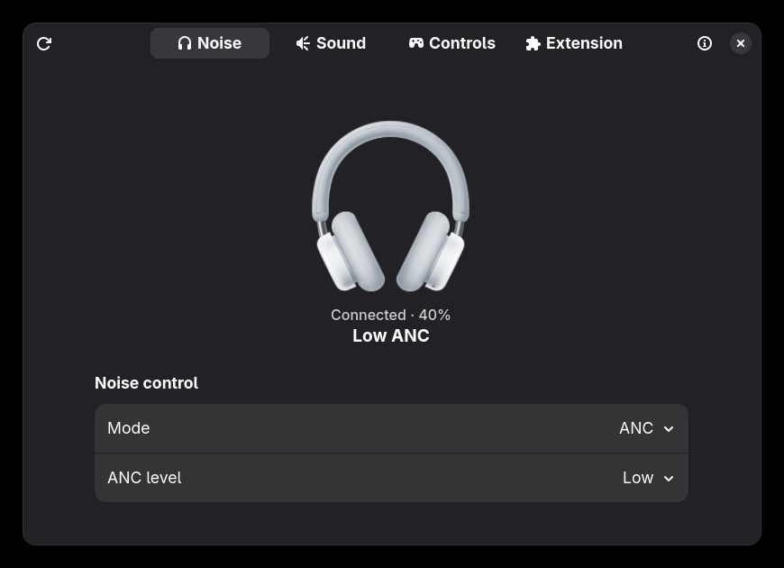
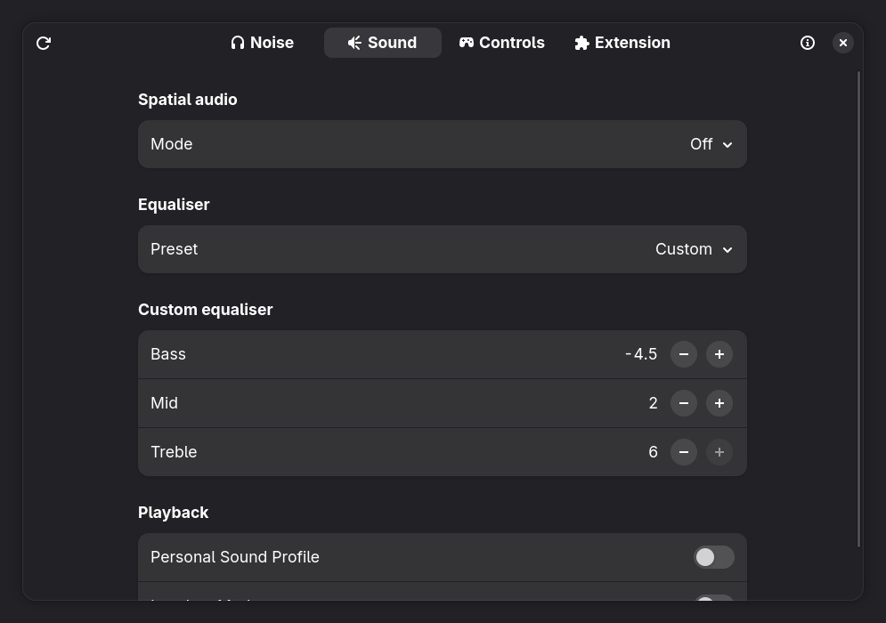
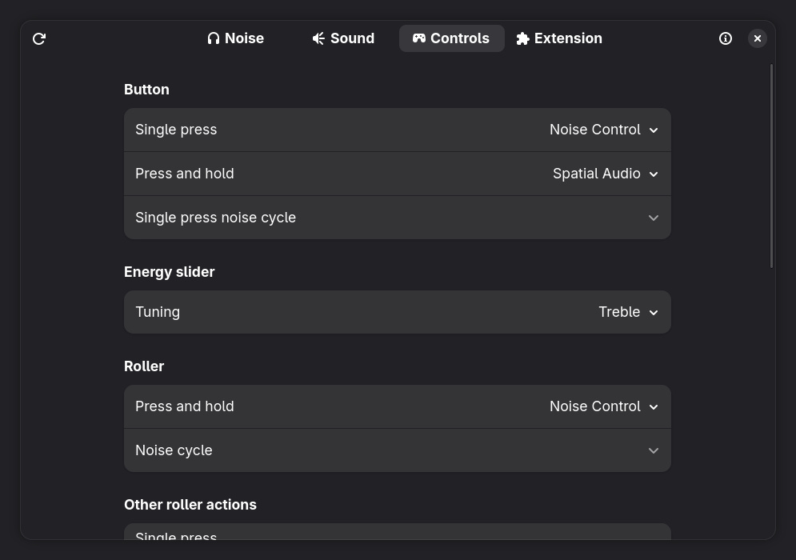
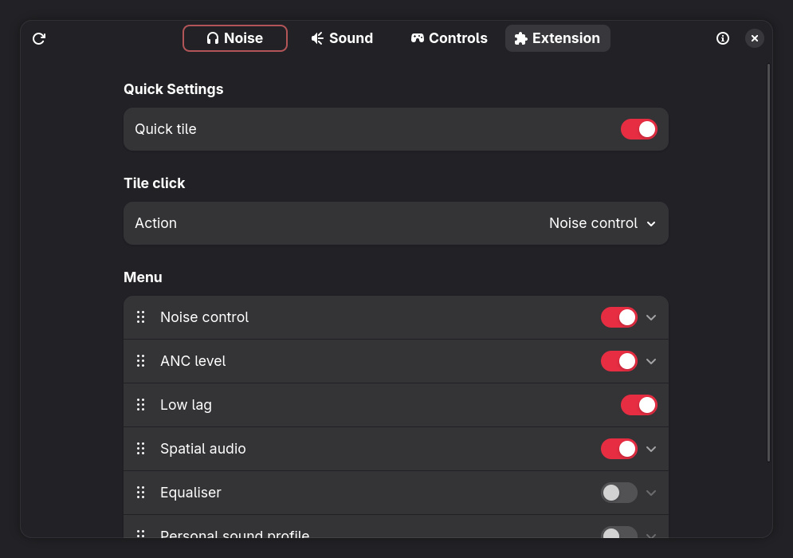

# CMF Headphone Pro Controls

GNOME Shell 50 Quick Settings extension with a GTK4/libadwaita controls window.
The extension communicates directly with a connected CMF Headphone Pro over
BlueZ RFCOMM channel 28. Python 3, PyGObject, GTK4, libadwaita, and
`bluetoothctl` are required. No web server or third-party Python package runs.

The Quick Settings tile shows the selected click action and its current value.
Its arrow opens the configured menu. **Open controls…** or the Extensions app's
settings button opens the full window.
Changes are read back from the headphones before the UI accepts them. The tile
polls for connection and settings changes every 15 seconds. The window refreshes
on open and has a refresh button. Typing in the controls window opens native
search without a persistent search icon.

Quick tile visibility, click action, menu order, and cycle options are stored in
`~/.config/cmf-headphone-pro/config.json`. Both interfaces use that file. The
controller serializes Bluetooth transactions with a lock in the runtime directory.
Physical button and roller noise-cycle choices use the headset's supported
three-mode and two-mode combinations.

The extension UUID is `cmf-headphone-pro@dlc4sacchi.github.io`. The extension
is independent of CMF and Nothing. The headphone image is the light-grey
product render from the [official CMF storefront](https://cdn.shopify.com/s/files/1/0580/5214/9415/files/CMF_Headphone1-light-grey.png?v=1758800639).

## Screenshots

| Noise control | Sound |
| --- | --- |
|  |  |
| Physical controls | Extension settings |
|  |  |

## Install from source

Install Python 3, PyGObject, GTK 4, libadwaita, and BlueZ. Pair the headphones
through GNOME Bluetooth. From the repository root, build the bundle with:

```sh
gnome-extensions pack . \
  --extra-source=app.py --extra-source=controller.py \
  --extra-source=config.py --extra-source=prefs.js \
  --extra-source=headphones.png \
  --extra-source=LICENSE --extra-source=README.md
```

Unpack the ZIP into
`~/.local/share/gnome-shell/extensions/cmf-headphone-pro@dlc4sacchi.github.io/`.
Log out and back in after the first install, then enable the extension in the
Extensions app. The GNOME Extensions website will provide the normal install
flow once the first version is approved.

The small Python controller is needed for direct Bluetooth RFCOMM sockets,
which GNOME Shell's GJS/Gio APIs do not expose. It runs only for headset
transactions; there is no background web service. The source is licensed under
GPL-3.0-or-later.

The headphones must be paired and connected in GNOME Bluetooth first. When
disconnected, the tile and headset controls are disabled; extension settings
remain editable. A separate short-lived controller process stops the locating
sound after ten seconds, even if the window or shell tile closes.
